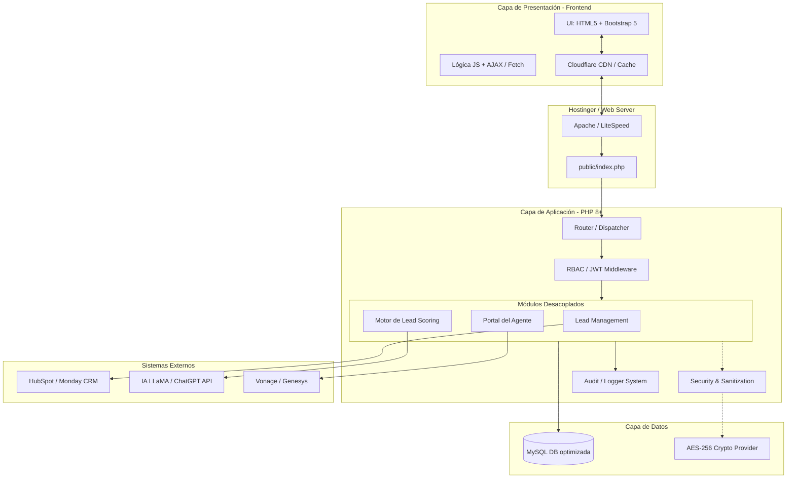

# Sistema Web Empresarial IMO Fintech/Insurtech

Este documento detalla la arquitectura, estructura y estrategia tecnológica para construir la plataforma solicitada desde cero, garantizando el cumplimiento normativo (HIPAA), alta performance (< 2s load time), y seguridad tipo Zero Trust. El backend estará basado en PHP 8+ con Clean Architecture (sin grandes frameworks innecesarios), alojado en Hostinger, y utilizando un stack Front-end de HTML5/CSS3/Vanilla JS/Bootstrap 5.

## User Review Required

> [!IMPORTANT]  
> Por favor, revisa detalladamente este plan arquitectónico (DB, carpetas, seguridad y estrategias). Una vez que lo apruebes, procederé a crear los conectores reales, las plantillas iniciales (el boilerplate), y la configuración base en la carpeta de tu proyecto. 

---

## 1. Arquitectura Completa del Sistema (Diagramas Lógicos)

El diseño propuesto emplea el patrón o arquitectura hexagonal o capas concéntricas (Clean Architecture), adaptado para shared hosting.



---

## 2. Estructura de Carpetas Profesional

Todo el código correrá sobre un entrypoint único para evitar la ejecución directa de scripts en el backend.

```text
/
├── .env.example              # Variables maestras
├── public/                   # Document Root (Hostinger apunta aquí)
│   ├── index.php             # Front Controller (Único acceso web)
│   ├── assets/               # CSS, JS, Fonts, Img (Minificados)
│   └── .htaccess             # Ruteo estricto, Security Headers, TLS forzado
├── src/                      # Código fuente principal
│   ├── Config/               # Configuraciones cargadas del .env (cero hardcode)
│   ├── Core/                 # Router, Container DI, Security, DB Connection
│   ├── Modules/              # Autocontenidos (Hexagonal)
│   │   ├── Leads/            # Controladores, Casos de uso, Modelos de Leads
│   │   ├── Agents/           # Controladores, Portal de agente
│   │   └── Audit/            # Sistema central de auditoría
│   └── Infrastructure/       # Integraciones con IA, Hubspot, Webhooks, etc.
├── storage/                  # Para uso offline o persistencia temporal local (fuera del Document Root)
│   ├── logs/                 # Backups de logs planos de sistema
│   └── cache/                # Cache persistente basada en archivos (para resiliencia)
├── database/                 # Scripts SQL de migraciones iniciales
└── build/                    # Scripts opcionales Node para empacar/minificar CSS/JS en deploy
```

---

## 3. Diseño de Base de Datos (MySQL) - Diagrama E/R Básico

Mantendremos la normalización estricta. Ningún dato "PHI" (Protected Health Information) o contraseña estará en texto plano. Se usará el sistema `AES_ENCRYPT()` o encriptación al nivel app (Sodium).

### Tablas Principales:
* **`users`**: `id`, `uuid`, `role_id`, `email`, `password_hash`, `2fa_secret`, `created_at`.
* **`roles_permissions`**: Gestor estricto para RBAC (Admin, Agent, Manager).
* **`leads`**: `id`, `uuid`, `encrypted_contact_data` (AES-256), `score`, `status`, `assigned_user_id`, `created_at`.
* **`audit_logs`**: `id`, `user_id`, `action`, `table_name`, `record_id`, `ip_address`, `user_agent`, `timestamp`. (Solo inserción, nunca actualización/borrado).
* **`offline_queue`**: `id`, `payload`, `endpoint_target`, `status` (pending, sent). Para sincronizaciones resilientes.

---

## 4. Endpoints API (Interacciones Principales RESTful)

Estas APIs consumirán desde el Frontend (JS Fetch) utilizando JWT en cabeceras o Sessión con Tokens Anti-CSRF.

* `POST /api/v1/auth/login` → Autenticación y 2FA
* `POST /api/v1/leads` → Captura de lead desde Landing Page (sanitizado)
* `GET /api/v1/agent/dashboard` → Métricas principales (TTFB optimizado)
* `POST /api/v1/webhooks/crm` → Recibir updates desde HubSpot/Monday
* `POST /api/v1/sync/offline` → Procesar batch de formularios que no salieron por falta de conexión.

---

## 5. Sistema de Configuración Centralizada

**`.env`** (Ejemplo):
```ini
APP_ENV=production          # local | demo | production
APP_URL=https://imo.com
DB_HOST=127.0.0.1
DB_NAME=empresaIMO_db
DB_USER=imo_user
DB_PASS=S3cr3t_P@ss!
AES_KEY=base64:XyZ...
API_LLM_KEY=sk-xxxx
```

**`src/Config/AppConfig.php`**: Single Source of Truth para configuraciones. Toma variables de entorno y provee getters tipados al resto de módulos (garantiza cero cadenas expuestas en la lógica de negocio).

---

## 6. Estrategia de Seguridad Implementada

1. **Cumplimiento HIPAA / Encriptación:** 
   - Base de datos MySQL con encriptación At-Rest.
   - Datos PII (Nombres, SSN, Teléfonos) pasan por Sodium / AES-256-GCM antes de guardarse.
2. **Zero Trust & RBAC:** Cada endpoint en el backend requerirá validación de token CSRF, validación de sesión (o JWT) y validación de permisos `auth()->can('ver_leads')`.
3. **OWASP Top 10 Protections:** Enrutador rehusará métodos HTTP prohibidos. Input validado mediante `filter_var()` combinado con Prepared Statements (`PDO`).
4. **TLS 1.3:** Forzado por webserver (`Strict-Transport-Security` Header).

---

## 7. Estrategia de Caching y CDN (Optimizando a <2s)

* **Cloudflare (CDN):** Proxy principal para entregar assets estáticos de forma perimetral. Activación de "Brotli/GZIP".
* **Front-end:** Tamaño de Javascript muy restringido (Vanilla JS o WebComponents siempre que sea posible, solo usar Bootstrap donde aplique sin incluir plugins masivos).
* **Back-end:** Al no tener Memcached/Redis habitualmente libres en Hostinger plan básico, se crea una caché basada en el sistema de archivos (`storage/cache/`) escrita en binario/serializado mediante PHP con un TTL, para vistas generadas previamente o respuestas API periódicas (ej. reportes estáticos).

---

## 8. Estrategia Autónoma y Resiliencia (CCaaS & IA)

* **Offline Queue:** Si el internet del Call Center o del usuario fluctúa (Starlink baja, etc.), JavaScript almacena los leads vía `IndexedDB/localStorage`. Al recuperar conexión vía `navigator.onLine`, sube los datos a `/api/v1/sync/offline`.
* **Lead Scoring & AI:** El backend interactúa asíncronamente (con Jobs de PHP, cron o colas si se logran simular en Shared Hosting mediante crontabs) con el endpoint del LLM para determinar perfiles e intensión de compra del Lead.

---

## 9. Plan de Despliegue en Hostinger

1. **Directorio Seguro:** Los ficheros se suben a tu espacio FTP de forma que `public/` en nuestro proyecto reemplace a `public_html/`. Lo que esté en `src/`, `config/` o `storage/` **DEBE quedar una carpeta más arriba** (fuera del `public_html`) para seguridad máxima.
2. **Setup Base de Datos:** Creación de la instancia en Hostinger CP y vaciado de los scripts `.sql` autogenerados.
3. **Cronjobs Hostinger:** Setup del gestor de tareas en Hostinger apuntando a `php /home/u12345/app/src/Console/ProcessQueue.php` cada minuto para manejar IA, webhooks y envíos masivos.

---

## 10. Checklist Mínimo Cumplimiento HIPAA y COPC 7.1

- [ ] Cifrado FIPS 140-2 AES-256 para almacenamiento.
- [ ] Auditoría de base de datos a nivel registro (quién leyó qué perfil / quién lo editó).
- [ ] Terminación automática de sesión inactiva administrativa en 15 minutos.
- [ ] No mostrar PII sensible de leads en listados grandes (solo last 4 digits de teléfono a menos que haya click explícito).
- [ ] Monitoreo métricas COPC (Speed to Lead se registra para SLA, <120s es el umbral de prioridad para la API de Lead Assignment).

---

## Propuesta de Pasos Siguientes Ejecutables:
Al darle el "Me parece bien", el script procederá a:
1. Crear el `.env` y el `Config` central.
2. Instalar el boilerplate arquitectónico base (carpetas y entrypoint `public/index.php`).
3. Sentar la configuración de capa de Modelos `PDO` con inyección de lógica AES.
4. Volcar un set de Landing page inicial usando el HTML/Bootstrap requerido asegurando Score Lighthouse verde.
